# Setting up a Web Server on Your DigitalOcean Droplet

## Step 1

Log in to your DigitalOcean account and open your project. Once there, you should be able to see your droplet under **Resources**:

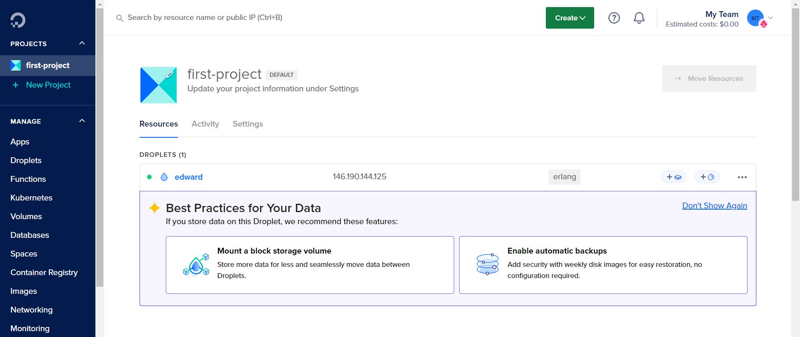

First, we must set up the **Demilitarized Zone** (DMZ or DZ) by creating a firewall. Under the left-hand **Manage** dropdown menu, click on **Networking**, then click on **Firewalls**.

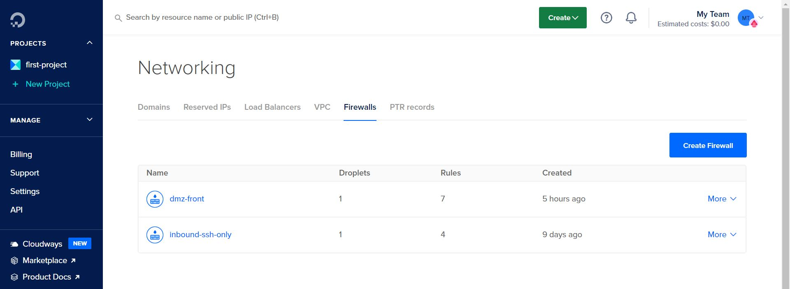

*_Note: The image above shows two firewalls, but you shouldn't have any yet._

Click on **Create Firewall**. You should see the following:

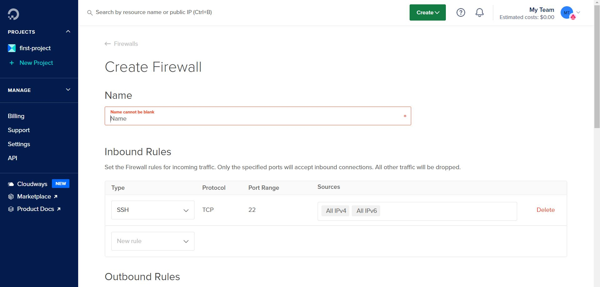

Name the firewall `dmz-front`. Then, under **Inbound Rules** and **Outbound Rules**, add the following rules as shown in the image below:

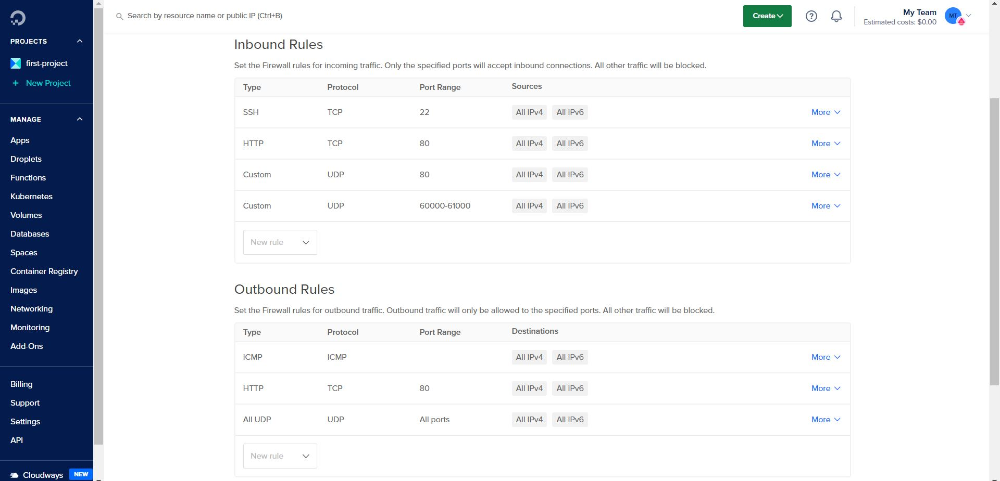

Make sure the **Port Range** for each rule is exactly as shown in the image above.

After you're done adding the rules, search for your droplet by name and add it using **Apply to Droplets**, like so:

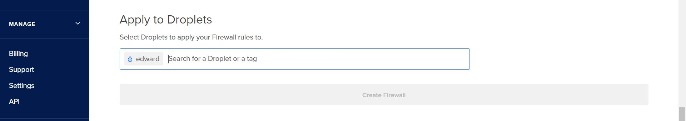

Finally, click **Create Firewall**.

## Step 2

Now, open up an instance of **Command Prompt** (or whichever command-line interface you use) and type `wsl`. You should see something like this:

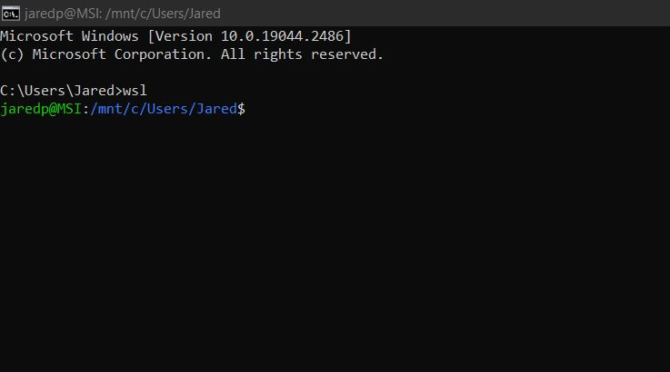

*_Note: It won't look exactly like this. But as long as Windows Subsystem for Linux is activated, you may proceed._

Now, you'll need to **SSH** into your droplet. (You should have that up on your machine last week.) Return to your project page on your DigitalOcean account and copy the **IP address**:

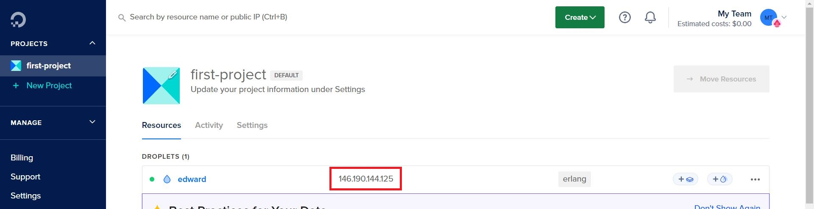

Once you have it, type `ssh <IP address>` into your command-line interface. Enter your passphrase. You should see something like this:

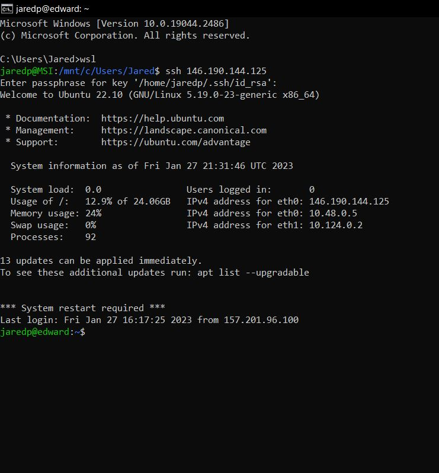

You should now have access to your droplet.

## Step 3

When you were setting up the SSH, you should have installed **rebar3** on your droplet. Type `rebar3 new app <name>`. A new app will be created with the name you provided.

Now, you will need to navigate into the new app. To do this, type `cd <name>`. Then type `ls` to see all the files and directories within your app. You should see something like this:

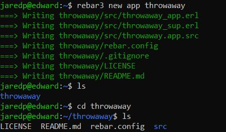

You will need to modify the `rebar.config` file. Type `vi rebar.config` to open up the text editor. Press `i` to activate **-- INSERT --**. In `deps`, you'll need to add **cowboy** like so:

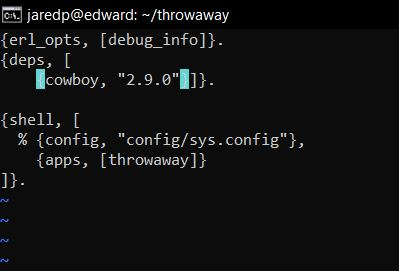

Once that's done, hit the **Escape** key. Then type `:w` and press `Enter` to save the file. Finally, type `:q` and press `Enter` to exit and return to the command line.

## Step 4

Type `cd src` followed by `ls`. You should see three files, `<name>.app.src`, `<name>_app.erl`, and `<name>_sup.erl`. Next, you will need to make edits to `<name>.app.src`. Type `vi <name>.app.src` to begin making edits.

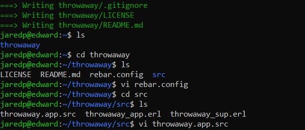

You will need to add `cowboy` under `stdlib` in `applications`. The file should look like this when you're done:

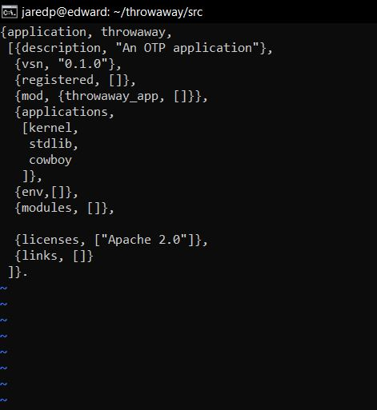

Save and exit the file. You're ready for the next step.

## Step 5

Type `vi <name>_app.erl` into the command line. There will already be some **Erlang** code in the file. You will need to make the following changes:

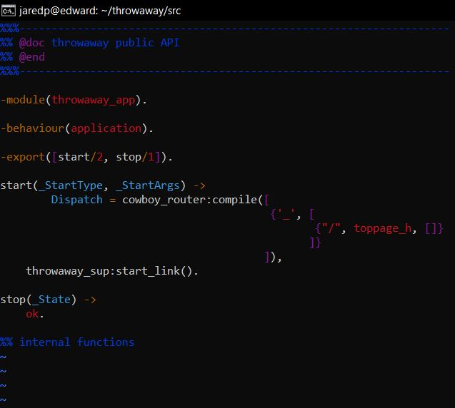

*_Note: Your module name and `<name>_sup:start_link()` will be different if you used a different name for your application._

Save and exit the file. Proceed to the sixth and last step.

## Step 6

Type `vi toppage_h.erl`. This will create a new file. Add the following code:

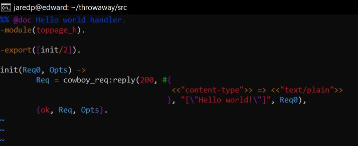

Save and exit the file. Type `cd ..` to go up a directory. Then type `rebar3 shell`. You should see this:

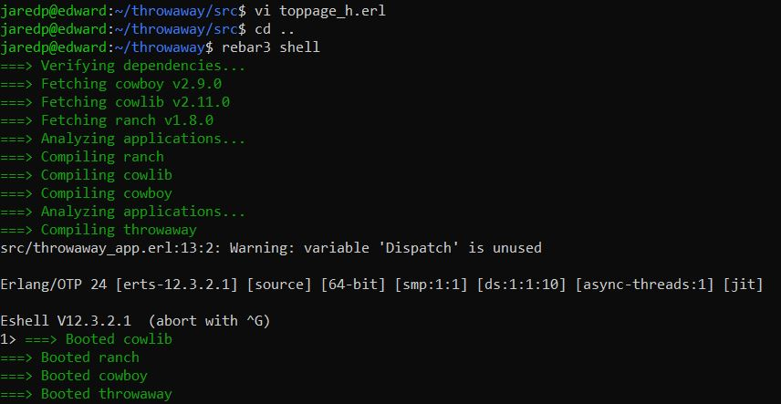

**You're done!** If you're curious to see what all these steps are leading to, you can open your browser and type `http://<IP address>` into the bar. You _should_ see this, or something like it:

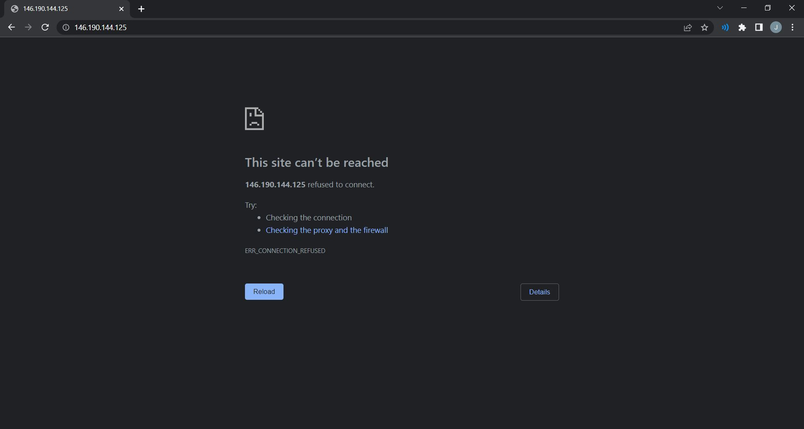

Don't worry. That's what should happen. We'll learn how to fix this later.